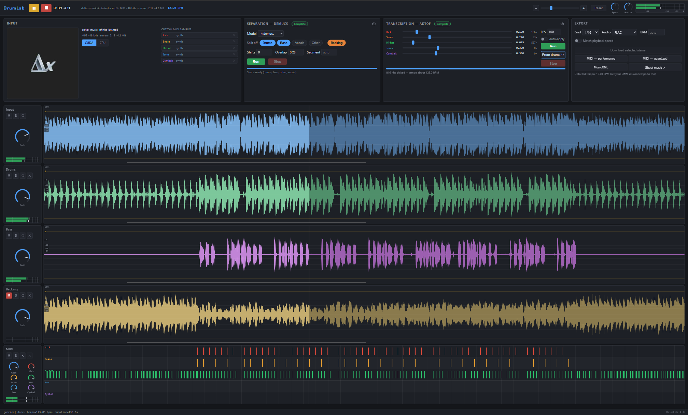

# Drumlab



A GUI wrapper around [Demucs](https://github.com/adefossez/demucs) and
[ADTOF](https://github.com/xavriley/ADTOF-pytorch) that separates a song into
its individual parts — drums, bass, vocals, the rest — transcribes the drums
to MIDI and sheet music, and lets you adjust the speed so you can play along.

Runs as a local web server — everything happens on your own machine, fully
offline, nothing leaves your computer.

---

## Features

- **Separate the track** — runs Demucs (full `htdemucs` separation) to split the song into
  drums / bass / other / vocals. Pick which sources to isolate; the rest can be summed into a
  single backing track.
- **Extract drum MIDI** — runs ADTOF over the audio to detect kick, snare, toms, hi-hat and
  cymbals, and turns them into MIDI. Per-instrument detection thresholds can be nudged
  on-the-fly — hits are re-picked instantly without re-running the model.
- **Verify & adjust** — listen back and decide for yourself whether you like the result.
  Make basic MIDI edits, loop a section, and dial in per-lane gain knobs, stereo level
  meters (dBFS), and a pitch-preserved playback-speed knob.
- **Export** — stems in FLAC / WAV / AAC / ALAC / AIFF / OGG, plus MIDI, quantized MIDI,
  and MusicXML. Optionally export at the current playback speed.

---

## Requirements

Everything installs into a single Python environment:

- **Python 3.10+** — a dedicated `venv` or conda environment is strongly recommended.
- **[FFmpeg](https://ffmpeg.org/)** on your `PATH` — audio decode, format conversion, and
  time-stretching.
- **[PyTorch](https://pytorch.org/)** (`torch` + `torchaudio`) — install a CUDA build for
  GPU acceleration (see [Install](#install)). A CPU-only build works too, just much slower.
- **[Demucs](https://github.com/adefossez/demucs)** — source separation, invoked as
  `python -m demucs`.
- **[ADTOF-pytorch](https://github.com/xavriley/ADTOF-pytorch)** — the drum-transcription
  model (imported as `adtof_pytorch`). Drumlab uses it as an installed package, or finds a
  sibling checkout at `../ADTOF-pytorch/src/adtof_pytorch`.
- **FastAPI + Uvicorn + python-multipart + music21** — the web server and MusicXML export.
  These are pure-Python and don't touch torch.

---

## Install

> The one thing to get right is **PyTorch first**, so GPU support sticks. Both Demucs and
> ADTOF list `torch` as a dependency; if you let pip install them before torch (or run
> `pip install -U` afterwards), pip can quietly swap your CUDA build for a CPU-only one.
> Everything still runs — just on the CPU. So: install torch, then everything else, then
> verify CUDA is still there.

1. **Get the code** (Drumlab and, optionally, ADTOF-pytorch side by side):

   ```sh
   git clone https://github.com/DomekRomek/Drumlab.git
   git clone https://github.com/xavriley/ADTOF-pytorch.git   # optional — pip-install alternative below
   cd Drumlab
   ```

2. **Create and activate an environment:**

   ```sh
   python -m venv .venv
   .venv\Scripts\activate          # macOS/Linux: source .venv/bin/activate
   ```

3. **Install PyTorch with CUDA.** Grab the exact command for your OS + CUDA version from
   the [official selector](https://pytorch.org/get-started/locally/). For example:

   ```sh
   pip install torch torchaudio --index-url https://download.pytorch.org/whl/cu130
   ```

   (Drop the `--index-url` for a CPU-only build.)

4. **Install the rest**

    If you cloned ADTOF-pytorch as a sibling folder instead, you can skip the second command.
   ```sh
   pip install demucs fastapi uvicorn python-multipart music21
   pip install --no-deps git+https://github.com/xavriley/ADTOF-pytorch.git
   ```

   <sub>*`--no-deps` stops pip from reinstalling torch over the CUDA build from step 3.*</sub>

5. **Verify CUDA (optional)**

   ```sh
   python -c "import torch; print(torch.__version__, torch.cuda.is_available())"
   ```

   If this prints `True`, you're set for GPU. If it flipped to `False`, you may want to try
   re-doing step 3.

6. **Install FFmpeg** if you don't have it ([download](https://ffmpeg.org/download.html)),
   and make sure `ffmpeg` is on your `PATH`.

```sh
python app.py --preload
```

---

## Run

```sh
.venv\Scripts\activate          # macOS/Linux: source .venv/bin/activate
python app.py
```

This starts the server on `127.0.0.1:8765` and opens it in your default browser.

| Flag | Effect |
| --- | --- |
| `--port N` | listen on a different port (default `8765`) |
| `--host ADDR` | bind address (default `127.0.0.1`; `0.0.0.0` to expose on your LAN) |
| `--no-browser` | don't open a browser window |
| `--preload` | download all Demucs models, then exit |

> **Single shared workspace.** DrumLab is a single-user tool: the server keeps one
> global state (current song, stems, transcription). Every browser that connects —
> including a second tab or another device when you bind with `--host 0.0.0.0` —
> sees and edits that *same* workspace. Loading a song on your phone replaces what's
> on your PC. This is by design; don't run two clients against one server expecting
> independent sessions.

---

## Structure

```
app.py                 FastAPI server + pipeline orchestration + exports
adtof_worker.py        ADTOF inference, run as a separate killable subprocess
requirements-extra.txt Drumlab's own (non-torch) dependencies
static/                single-page UI (index.html, app.js, style.css, score viewer)
static/vendor/         pinned local copies of WaveSurfer, Tone.js, OSMD (no CDN)
workdir/               runtime caches + generated downloads — safe to delete
```

## About

This started from wanting a slick way to prep songs to play along to and slow them down
to my skill level — on my own machine, without having to fiddle with my DAW every time.
As an intermediate drummer I just wanted one tool that did exactly what I wanted,
but after ironing wrinkles enough times it turned into something pleasant for me
to use, so I figured I'd put it out there in case it's useful to someone else.

## Contributors

- **DomekRomek** — system architecture, testing, debugging, UI/UX.
- **Claude** — code writing.

## Credits

Built on [Demucs](https://github.com/adefossez/demucs) for source separation and
[ADTOF-pytorch](https://github.com/xavriley/ADTOF-pytorch) for drum transcription, with
[music21](https://web.mit.edu/music21/) for MusicXML, [FastAPI](https://fastapi.tiangolo.com/)
and [Uvicorn](https://www.uvicorn.org/) running the server, and
[WaveSurfer.js](https://wavesurfer.xyz/), [Tone.js](https://tonejs.github.io/), and
[OpenSheetMusicDisplay](https://opensheetmusicdisplay.org/) for the UI.

**Thank you to the developers of these projects for making my life easier.**
